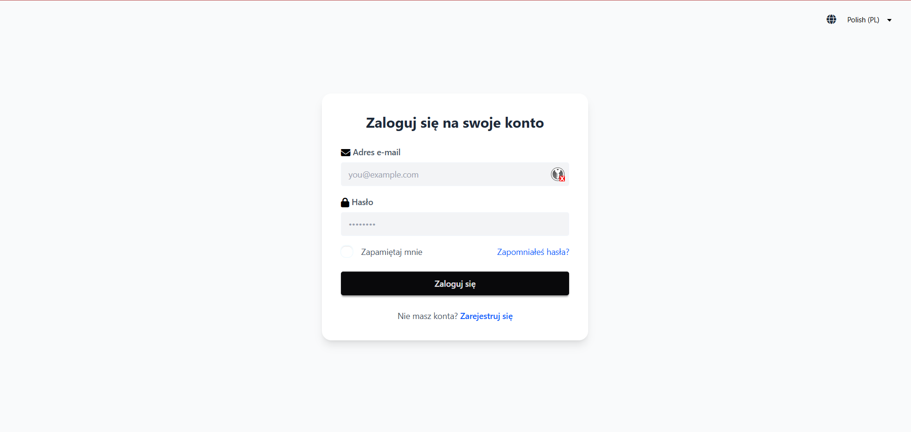
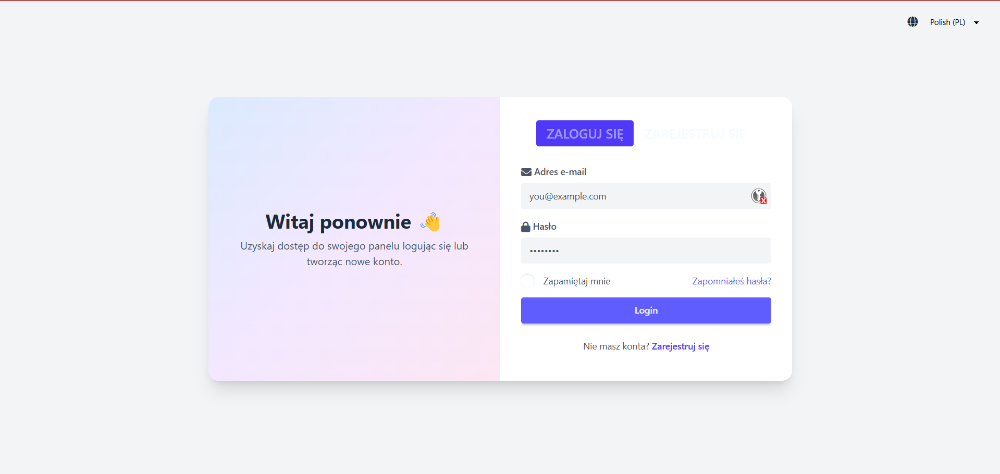
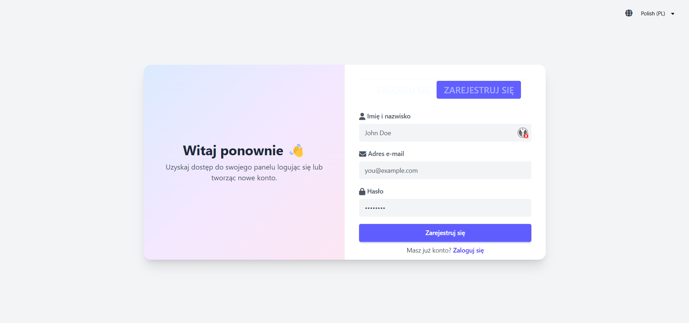
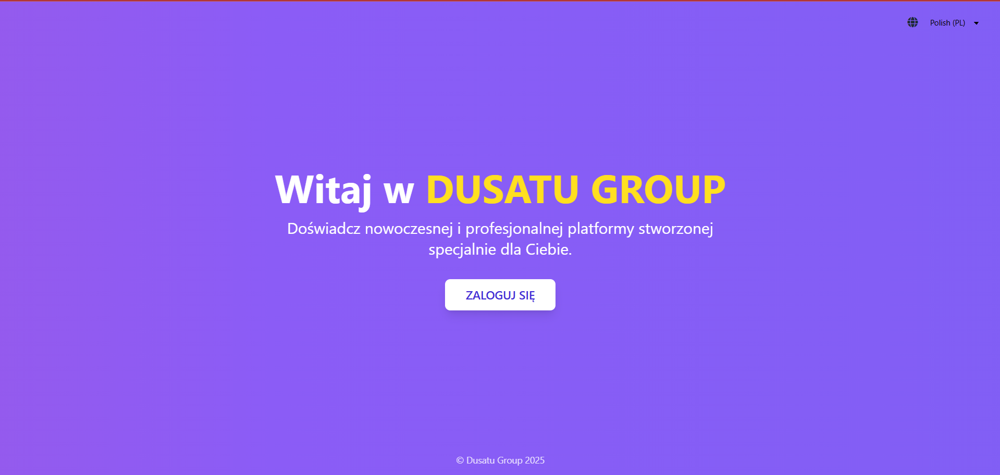
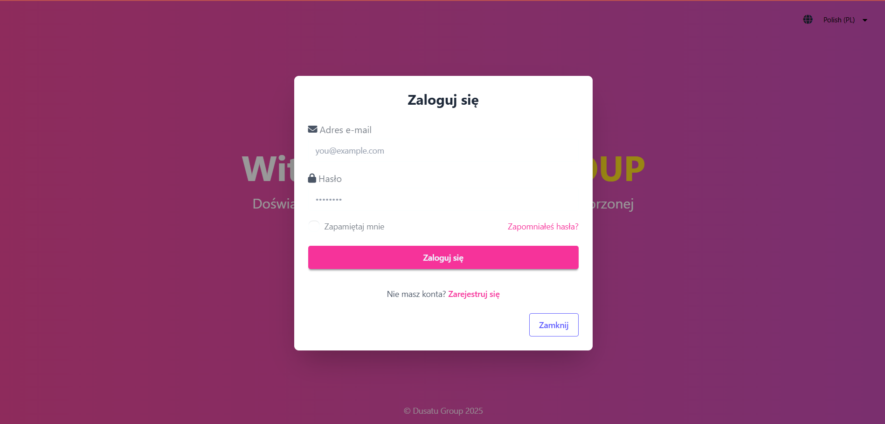

# Project Title

## 📸 Screenshots

### Design 1



### Design 2




### Design 3




---

## 🛠️ Tools & Libraries Used

- [Vite](https://vitejs.dev/) — Fast frontend build tool
- HTML
- TypeScript (TS)
- [DaisyUI](https://daisyui.com/) — Tailwind CSS Components
- [Tailwind CSS](https://tailwindcss.com/) — Utility-first CSS framework
- [i18next](https://www.i18next.com/) — Internationalization framework

---

## 🚀 Instructions to Run Locally

1. **Clone the repository**

   ```bash
   git clone https://github.com/yourusername/your-repo.git
   cd your-repo
   ```

2. **Install dependencies**

```bash
npm install
```

3. **Run the development server**

```bash
npm run dev
```

Open your browser and go to http://localhost:5173 to view the pages.

4. **Build for production**

```bash
npm run build
```

5.**Preview the production build**

```bash
npm run preview
```
